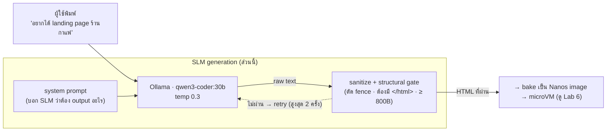

# Live-Agent Prompts — prompt ที่ใช้ให้ SLM สร้างเว็บจากประโยคเดียว

> **คนละเรื่องกับ Lab 6 / Topology** — ส่วนนี้คือ "สมอง" ฝั่ง LLM ของ live-agent:
> ชุด **system prompt** ที่ใช้สั่ง SLM (qwen3-coder) ให้เปลี่ยน *คำสั่งภาษาคน* → *เว็บไซต์ HTML*
> ก่อนเอาไป bake เป็น microVM (ขั้นนั้นอยู่ใน Lab 6)

นี่คือ prompt **จริง** ที่ live-agent ใช้ คัดมาเป็นตัวอย่าง/ไกด์เพื่อให้นำไปปรับใช้เองได้

---

## ภาพรวม: prompt อยู่ตรงไหนของ pipeline



**หัวใจ:** ความเสถียรไม่ได้มาจาก prompt อย่างเดียว — มาจาก **prompt + gate ฝั่ง output**
(SLM มักแถม markdown/คำอธิบาย → ต้อง sanitize + ตรวจโครงสร้างก่อนใช้เสมอ)

---

## 3 โหมด (3 system prompt)

มี prompt ดิบให้ในโฟลเดอร์ [`prompts/`](./prompts/) — ก๊อปไปใช้ได้เลย

### 1) Single-prompt → ทั้งหน้า HTML  ([`prompts/system-html.txt`](./prompts/system-html.txt))
ผู้ใช้พิมพ์ประโยคเดียว → ได้ HTML ทั้งหน้า self-contained

```
system: (system-html.txt)
user:   <ข้อความผู้ใช้ดิบ ๆ>           # เช่น "landing page ร้านกาแฟ โทนอุ่น"
```

### 2) Composer fragment → เขียนทีละ section  ([`prompts/system-fragment.txt`](./prompts/system-fragment.txt))
ใช้ตอนประกอบหน้าจาก layout หลาย block — SLM เขียน *เฉพาะ fragment* ของแต่ละ section
แล้วเอามาเย็บเป็นหน้าเดียว (รูปฝังเป็น base64 → self-contained)

```
system: (system-fragment.txt)
user:   Write the '<role>' section. <prompt ของ block นั้น>
```

### 3) Sitemap → ร่างโครงทั้งไซต์เป็น JSON  ([`prompts/system-sitemap.txt`](./prompts/system-sitemap.txt))
"ร่างทั้งไซต์จากประโยคเดียว" — SLM คืน **โครงสร้างไซต์เป็น JSON** (หน้า + บล็อก + prompt ต่อบล็อก)
แล้วค่อยวนเรียกโหมด (2) เติมเนื้อแต่ละบล็อก

```
system: (system-sitemap.txt)
user:   Brand: <แบรนด์>
        Description: <อธิบายสั้น ๆ>
        Design a complete, realistic website sitemap as JSON.
```

---

## ค่า generation (ที่ใช้จริง)

| พารามิเตอร์ | ค่า | หมายเหตุ |
|------------|-----|----------|
| โมเดลหลัก | `qwen3-coder:30b` (ollama) | คุณภาพสูง |
| โมเดลสำรอง/เร็ว | `qwen2.5:7b` (warm-GPU) | เล็กกว่า เร็วกว่า |
| `temperature` | **0.3** | ต่ำ → ผลนิ่ง/คาดเดาได้ (โค้ดไม่ใช่ creative writing) |
| `num_predict` | 8192 (ทั้งหน้า) · 2000 (fragment/sitemap) | เพดาน token output |
| timeout | 300s (HTML) · 180s (sitemap) | |
| retry | 2 ครั้ง | ถ้า output พัง/degenerate ลองใหม่ |
| endpoint | `POST /api/generate` (Ollama) | body: `{model, prompt, system, stream:false, options:{temperature,num_predict}}` |

---

## output gate (สำคัญ — อย่าข้าม)

SLM เชื่อ output ตรง ๆ ไม่ได้ ต้องผ่านด่านก่อนใช้:

**โหมด HTML:**
1. **sanitize** — ตัด markdown fence / คำนำหน้า, เก็บเฉพาะ `<!doctype> … </html>`
2. **structural gate** — ต้องลงท้าย `</html>` + มี `<body` + ขนาด ≥ **800 bytes** (กัน refusal/skeleton)
3. ไม่ผ่าน → retry (สูงสุด 2) → ถ้ายังพัง = fail (ไม่เอา garbage ไป deploy)

**โหมด sitemap (JSON):**
- parse แบบ tolerant (ดึง `{...}` ก้อนแรกออกมา ทนต่อ fence/prose)
- **coerce + clamp** ให้อยู่ในสเปกที่ปลอดภัย (1..5 หน้า, cols 1..3, type ที่อนุญาตเท่านั้น)
- พังจริง → คืน **fallback sitemap** (ไม่ปล่อยให้ flow ตัน)

> บทเรียน: **"prompt บอกให้ทำ + gate บังคับให้ถูก"** — ลำพัง prompt ('no code fences') ยังหลุดได้
> โค้ดฝั่งรับต้อง defensive เสมอ

---

## เอาไปใช้เองยังไง (reuse)

prompt พวกนี้เป็น plain text ใช้กับ endpoint ไหนก็ได้:

```bash
# ตัวอย่าง: Ollama
curl http://localhost:11434/api/generate -d "{
  \"model\": \"qwen2.5:7b\",
  \"system\": \"$(cat prompts/system-html.txt)\",
  \"prompt\": \"landing page ร้านกาแฟ โทนอุ่น มีเมนูและเวลาเปิด-ปิด\",
  \"stream\": false,
  \"options\": {\"temperature\": 0.3, \"num_predict\": 8192}
}"
# → เอา .response ไป sanitize (ตัด fence, เก็บ <!doctype>..</html>) ก่อนใช้
```

ใช้กับ OpenAI-compatible ก็ได้: เอา `system-*.txt` ใส่เป็น `system` message, ข้อความผู้ใช้เป็น `user`

---

## ข้อจำกัด (อ่านก่อนใช้จริง)

- **ผูกกับพฤติกรรมโมเดล** — prompt นี้ปรับจูนกับ qwen3-coder/qwen2.5 โมเดลอื่นอาจหลุด format ต่างกัน
  (ต้องปรับถ้อยคำ + เกณฑ์ gate เอง)
- **gate คือส่วนที่ขาดไม่ได้** — ถ้าเอา prompt ไปใช้แต่ไม่ทำ sanitize/structural gate จะเจอ
  markdown fence / คำอธิบาย / หน้า skeleton หลุดไป deploy
- **JSON จาก SLM ไม่น่าเชื่อถือ** — โหมด sitemap ต้อง parse แบบ tolerant + clamp + มี fallback เสมอ
- **คุณภาพ/ความเร็วแลกกัน** — 30b สวยกว่าแต่หนัก, 7b เร็วกว่าแต่หยาบกว่า (เลือกตาม use case)
- **`temperature 0.3` เหมาะกับ "โค้ด/โครงสร้าง"** — ถ้าอยากได้ดีไซน์หลากหลายขึ้นต้องเพิ่ม (แลกความนิ่ง)
- **prompt เป็นภาษาอังกฤษ** (สั่ง SLM) แต่ output ตามภาษาใน user prompt ได้ (ไทย/อังกฤษ)
- **ไม่มี guard เนื้อหา** — prompt ไม่ได้กรองเนื้อหาไม่เหมาะสม/ความปลอดภัยของ HTML ที่ gen (ถ้าเปิดให้คนนอกใช้ ควรเพิ่ม sandbox + content filter เอง)

---

> นี่เป็น **ไกด์/ตัวอย่าง** — ปรับ prompt, เกณฑ์ gate, โมเดล, อุณหภูมิ ให้เหมาะกับงานคุณได้ตามสะดวก
