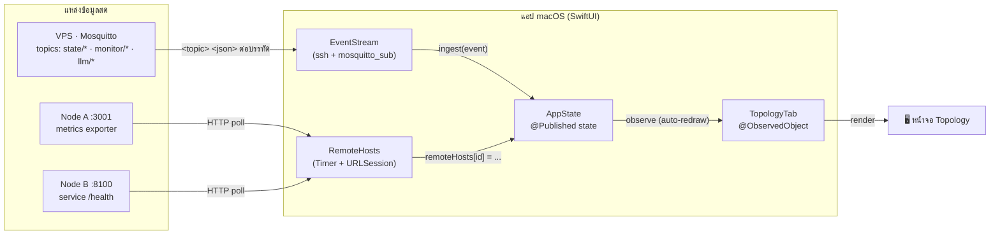
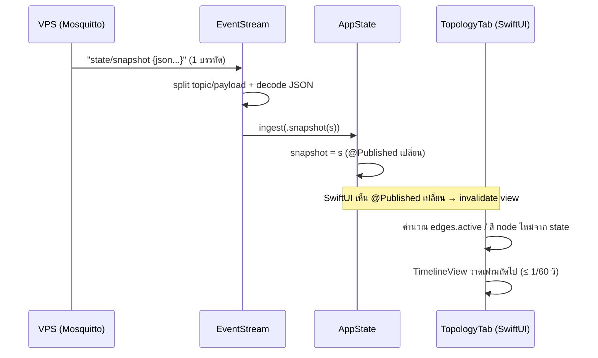
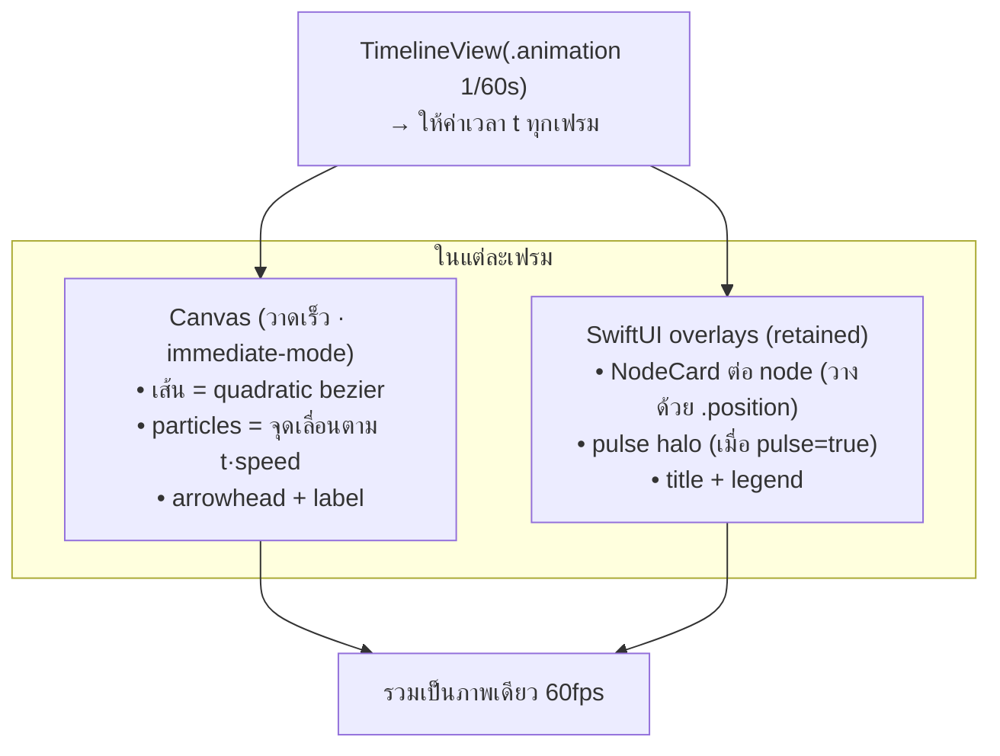

# Topology Tab — ตัวอย่าง + ไกด์สร้างเอง (ฉบับละเอียด)

หน้าจอ **"Topology"** ของแอป AI-SRE Monitor (macOS, SwiftUI): ไดอะแกรมระบบที่
**เคลื่อนไหว 60fps** — แต่ละ node = เครื่อง/บริการ, แต่ละเส้น = การไหลของข้อมูล
(particle วิ่งตามทิศ data flow), สีของ node = สถานะสด (เขียว/เหลือง/แดง)

> เอกสารนี้เป็น **ไกด์** อธิบายว่ามันทำงานอย่างไร + ใช้โครงสร้างอะไร + **ข้อจำกัดมีอะไรบ้าง**
> เพื่อให้คุณนำไปสร้างหน้าแบบนี้เองได้ และดัดแปลงให้เข้ากับระบบของคุณ
>
> - โค้ดตัวอย่างจริง: [`TopologyTab.swift`](./TopologyTab.swift) (ชุดเดียว — ดู §6)
> - รันได้ทันที: `swift run` (มี stub + sample data ให้แล้ว — ดู §6)

---

## สารบัญ

1. [ภาพรวม: ข้อมูลไหลจากไหน → ขึ้นจอ](#1-ภาพรวม-ข้อมูลไหลจากไหน--ขึ้นจอ)
2. [ข้อมูลสดวิ่งเข้าจอยังไง (1 รอบอัปเดต)](#2-ข้อมูลสดวิ่งเข้าจอยังไง-1-รอบอัปเดต)
3. [กลไกการวาด (rendering pipeline)](#3-กลไกการวาด-rendering-pipeline)
4. [ส่วนประกอบในโค้ด — อธิบายทีละชิ้น](#4-ส่วนประกอบในโค้ด--อธิบายทีละชิ้น)
5. [Data contract — ต้องป้อนอะไรให้หน้านี้](#5-data-contract--ต้องป้อนอะไรให้หน้านี้)
6. [รัน standalone ได้ทันที (มี stub ให้)](#6-รัน-standalone-ได้ทันที-มี-stub-ให้)
7. [สร้างหน้าแบบนี้เองทีละขั้น](#7-สร้างหน้าแบบนี้เองทีละขั้น)
8. [ข้อจำกัด (อ่านก่อนเอาไปใช้จริง)](#8-ข้อจำกัด-อ่านก่อนเอาไปใช้จริง)
9. [ปรับใช้ได้ตามสะดวก](#9-ปรับใช้ได้ตามสะดวก)

---

## 1. ภาพรวม: ข้อมูลไหลจากไหน → ขึ้นจอ



**หลักการ = one-way data flow (ทางเดียว):**
แหล่งข้อมูล → `AppState` (state ที่เดียว) → View อ่านแล้ววาด
View **ไม่ดึงข้อมูลเอง** — แค่ "สะท้อน" state ปัจจุบัน เมื่อ state เปลี่ยน SwiftUI รีเฟรชจอให้อัตโนมัติ
ข้อดี: ตรรกะ network/parse อยู่นอก View ทั้งหมด → View ทดสอบ/พรีวิวง่าย (แค่ป้อน state ปลอม)

**2 ช่องทางข้อมูลที่ต่างกันโดยสิ้นเชิง:**
- **EventStream** = push (MQTT subscribe ผ่าน ssh) → ได้ข้อมูล host หลักแบบ realtime ทันทีที่มี event
- **RemoteHosts** = pull (HTTP poll เป็นจังหวะด้วย Timer) → ได้สถานะ host รอง (Node A, Node B)

ทั้งคู่ปลายทางเดียวกัน: เขียนลง `@Published` ของ `AppState`

---

## 2. ข้อมูลสดวิ่งเข้าจอยังไง (1 รอบอัปเดต)



จุดสำคัญ:
- `EventStream` แปลงบรรทัด `mosquitto_sub -v` (รูปแบบ `<topic> <payload>`) → decode JSON → เรียก `AppState.ingest(...)`
- `@Published` คือกลไกของ SwiftUI: พอค่าเปลี่ยน View ที่ `@ObservedObject`/`@StateObject` อยู่จะถูกสั่งวาดใหม่
- เส้นจะ **"มีชีวิต" (particle วิ่ง)** เฉพาะเมื่อ `active == true` เช่น
  - Mac→VPS active เมื่อ `state.snapshot != nil`
  - Mac→Node A active เมื่อ `state.remoteHosts["nodeA"]?.reachable == true`

---

## 3. กลไกการวาด (rendering pipeline)



**ทำไมแบ่ง Canvas + overlay (สำคัญต่อ performance):**
- **`Canvas`** = immediate-mode drawing — วาดของซ้ำเยอะ ๆ ต่อเฟรม (เส้น + particle หลายสิบจุด)
  ได้โดย **ไม่สร้าง View object จริง** ต่อ particle → เร็ว ไม่ระเบิด view tree
- **SwiftUI overlay** = retained views — เหมาะกับ `NodeCard` ที่อยากได้เงา/เกรเดียนต์/แอนิเมชัน pulse
  และจัดวางง่ายด้วย `.position(...)` (มีไม่กี่ตัว = ไม่กระทบ performance)

**คณิตของ particle:**
- เส้นเป็น **quadratic bezier** (จุดควบคุม 1 จุด ดึงตั้งฉากจากจุดกึ่งกลางเพื่อให้เส้น "โค้ง" ไม่ทับกัน)
  คุมทิศโค้งด้วย `curveSign` (-1 / +1 / 0)
- ตำแหน่งบนเส้นคำนวณจาก `B(t) = (1-t)²·P0 + 2(1-t)t·P1 + t²·P2` (ฟังก์ชัน `bezierPoint`)
- particle วิ่งวนด้วย `phase = (t·speed + offset) mod 1` — `offset` ทำให้หลาย particle กระจายตัวบนเส้น
- หัว particle จาง-เข้มตาม `phase` (`opacity = 0.4 + 0.5·(1-phase)`) + มี halo (วงเรืองรอบ)

---

## 4. ส่วนประกอบในโค้ด — อธิบายทีละชิ้น

| ส่วน (ใน `TopologyTab.swift`) | หน้าที่ + รายละเอียด |
|------------------------------|---------------------|
| `TopologyTab` | View นอกสุด — พื้นหลัง gradient เข้ม + ครอบ `AnimatedTopology` ผ่าน `GeometryReader` (เพื่อรู้ขนาดจอ) |
| `AnimatedTopology` | แกนหลัก — ถือ `state` + `size`, นิยาม node/edge, แล้ววาดทั้งหมดใน `TimelineView` |
| `positions` | พิกัด node เป็น **สัดส่วนของขนาดจอ** (เช่น `x: width*0.43`) → responsive ปรับตามขนาดหน้าต่าง |
| `EdgeDef` | struct นิยาม 1 เส้น: `from`/`to` (key node), `color`, `label`, `speed` (particle/วิ), `particleCount`, `curveSign`, `active` |
| `edges` | สร้าง list เส้นทั้งหมด + คำนวณ `active` จาก state (reachable / snapshot != nil) |
| `body` | `TimelineView` 60fps → ZStack ของ Canvas (เส้น+particle) + node overlays + title/legend |
| `drawEdge(...)` | วาด 1 เส้นครบชุด: track จาง + arrowhead + particles (ถ้า active) + label ที่กลางเส้น |
| `bezierPoint(...)` | คำนวณพิกัดบนเส้นโค้ง quadratic ที่พารามิเตอร์ `t` |
| `nodeViews` / `userNode`/`macNode`/`vpsNode`/`nodeANode`/`nodeBNode` | สร้าง `NodeCard` ของแต่ละเครื่อง พร้อมบรรทัดสถานะที่ดึงจาก state |
| `NodeCard` | การ์ด node 1 ใบ: ไอคอน + ชื่อ + บรรทัดข้อความ + จุดสถานะ + **pulse halo** (วงเรืองเต้นเมื่อ `pulse=true`) |
| `primaryStatusColor` | map สถานะ host หลัก → สี: มี incident=แดง · service ไม่ครบ=เหลือง · ปกติ=เขียว |
| `remoteColor(_:)` | map สถานะ host รอง → สี: ไม่ถึง=แดง · degraded=เหลือง · ปกติ=เขียว |
| `formatK(_:)` | ฟอร์แมตเลขใหญ่ (1_900_000 → "1.9M") |
| `legendBox` / `legendRow` | กล่องคำอธิบายสีเส้น |

---

## 5. Data contract — ต้องป้อนอะไรให้หน้านี้

หน้านี้อ่านจาก `AppState` เท่านั้น โดยใช้ field เหล่านี้ (เวอร์ชันเต็มที่คอมไพล์ได้อยู่ใน
[`demo/AppStateStub.swift`](./demo/AppStateStub.swift)):

```swift
final class AppState: ObservableObject {
    @Published var snapshot: StateSnapshot?                  // ข้อมูล host หลัก (จาก MQTT)
    @Published var remoteHosts: [String: RemoteHostState]    // ผล probe host อื่น (key: "nodeA","nodeB")
    @Published var recentLLMCalls: [LLMCallRow]              // ใช้แค่ .count (โชว์จำนวน)
    @Published var snapshotHistory: [(ts: Int, snap: StateSnapshot)]  // ใช้แค่ .count
}

struct StateSnapshot {
    var activeServiceCount: Int      // service ที่ active
    var totalServiceCount: Int       // service ทั้งหมด → active<total ⇒ เหลือง
    var gpu: GPUInfo?                 // .name โชว์ใน subtitle ของ node หลัก
    var aiSre: AISre
}
struct AISre   { var llm: LLMStats?; var incidentsOpen: Int? }   // incidentsOpen>0 ⇒ แดง
struct LLMStats{ var calls24h: Int?; var tokensTotal24h: Int? }  // โชว์ "LLM 24h: N calls · Xtok"
struct GPUInfo { var name: String }

struct RemoteHostState {
    var reachable: Bool          // false ⇒ เส้นไป host นั้นหยุดวิ่ง + node แดง
    var summary: String          // ข้อความสรุปบน node card
    var latencyMs: Double?       // โชว์ "latency N ms" ถ้ามี
    var healthStatus: String     // "degraded" ⇒ เหลือง
}
```

**กฎ map ข้อมูล → ภาพ (สรุป):**

| เงื่อนไขใน state | ผลบนจอ |
|-----------------|--------|
| `snapshot != nil` | VPS online → เส้น Mac↔VPS เดินเครื่อง + node หลักเต้น (pulse) |
| `remoteHosts["x"].reachable == true` | เส้นไป host นั้น active (particle วิ่ง) + node เต้น |
| `aiSre.incidentsOpen > 0` | node หลัก = แดง |
| `activeServiceCount < totalServiceCount` | node หลัก = เหลือง |
| `healthStatus == "degraded"` | host รอง = เหลือง |
| `reachable == false` | host รอง = แดง + เส้นหยุดวิ่ง |

---

## 6. รัน standalone ได้ทันที (มี stub ให้)

มี **TopologyTab.swift ชุดเดียว** (ไฟล์ตัวอย่างที่ root) — `Package.swift` อ้างไฟล์นี้ตรง ๆ ผ่าน
`sources` list **ไม่มีสำเนาซ้ำ**. มี stub `AppState` + sample data ครบ → คอมไพล์/รันได้โดย
**ไม่ต้องมีทั้งแอป AI-SRE Monitor** (ทดสอบบน macOS 13+ · Swift 5.9+ แล้วผ่าน — `Build complete!`)

```bash
cd topology      # โฟลเดอร์ที่มี Package.swift
swift build              # เช็กว่าคอมไพล์ผ่าน → "Build complete!"
swift run                # เปิดหน้าต่างไดอะแกรมจริง (sample data ทุก host online)

# render เป็นรูป PNG แบบ headless (ไม่ต้องเปิดหน้าต่าง — ใช้ ImageRenderer):
swift run TopologyDemo --render topology-demo.png
```

ตัวอย่างผลลัพธ์: `topology-demo.png` (render จาก sample data)

หรือเปิดโฟลเดอร์ `topology/` ใน **Xcode** → กด canvas preview (`#Preview` ใน `demo/AppStateStub.swift`)

อยากเห็นสีเปลี่ยนตอนระบบมีปัญหา → ใน `demo/AppStateStub.swift` แก้ `@StateObject private var state = AppState.sample`
เป็น `AppState.degraded` (incident เปิด = node แดง · Node A degraded = เหลือง · Node B ดับ = เส้นหยุดวิ่ง)

**โครงสร้าง (TopologyTab ชุดเดียว):**
```
topology/
├── README.md              ← เอกสารนี้
├── TopologyTab.swift      ← ★ ตัวอย่างชุดเดียว (package อ้างไฟล์นี้ตรง ๆ)
├── Package.swift          ← sources: ["TopologyTab.swift", "demo/AppStateStub.swift"]
└── demo/
    └── AppStateStub.swift ← stub types + AppState.sample/.degraded + @main + #Preview
```

---

## 7. สร้างหน้าแบบนี้เองทีละขั้น

1. **ทำ state กลาง** — class `ObservableObject` + `@Published` ใส่ข้อมูลระบบคุณ
   (จะมาจาก MQTT, WebSocket, SSE, REST poll อะไรก็ได้ — แค่ให้มันอัปเดต `@Published`)
2. **นิยาม node + ตำแหน่ง** — `[String: CGPoint]` เป็นสัดส่วนของขนาดจอ (responsive)
3. **นิยาม edge** — struct เก็บ from/to/สี/label/ความเร็ว/`active`
4. **ครอบด้วย `TimelineView(.animation(minimumInterval: 1/60))`** เพื่อได้เวลา `t` ต่อเฟรม
5. **วาดเส้น+particle ใน `Canvas`** — bezier path + จุดเลื่อนตาม `t·speed`
6. **วาง node เป็น SwiftUI overlay** ด้วย `.position(...)` (การ์ด + pulse halo)
7. **map สถานะ→สี** ให้ผู้ดูอ่านสุขภาพระบบได้ใน 1 วินาที
8. **legend** บอกความหมายสีเส้น

> เคล็ดที่ทำให้ "ดูมีชีวิต": particle วิ่งตามทิศจริงของข้อมูล + pulse เฉพาะ node ที่ online +
> สีเปลี่ยนตามสถานะสด → ผู้ดูเข้าใจระบบโดยไม่ต้องอ่านตัวเลข

---

## 8. ข้อจำกัด (อ่านก่อนเอาไปใช้จริง)

ตัวอย่างนี้ออกแบบมาเพื่อ **"สอน/เป็นจุดตั้งต้น"** ไม่ใช่ component สำเร็จรูป — ข้อจำกัดที่ควรรู้:

**โครงสร้าง / การนำไปใช้**
- **topology เป็นแบบ hardcoded 5 node** (`user`/`mac`/`vps`/`nodeA`/`nodeB`) — ไม่ใช่ data-driven
  เพิ่ม/ลด node = ต้องแก้โค้ด (`positions`, `nodeViews`, `edges`) ไม่ใช่แค่ป้อนข้อมูล
- **ตำแหน่ง node วางมือ** (สัดส่วนคงที่) — ไม่มี auto-layout. ถ้า node เยอะ (>~8) จะเริ่มทับกัน
  ต้องใส่ layout algorithm เอง (force-directed / grid / hierarchical)
- **เส้นกันทับด้วย `curveSign` ที่ตั้งมือ** ต่อเส้น — ไม่ใช่ edge-routing อัตโนมัติ
- **label วาดบน Canvas** ด้วย `ctx.draw(Text...)` — ถ้าหน้าต่างเล็กหรือ label ยาว อาจล้น/ทับเส้นอื่น
- **อ้างไฟล์ข้างนอกผ่าน `sources` list** — ถ้าคัดเฉพาะ `demo/` หรือย้าย `TopologyTab.swift` ออก
  build จะพัง ต้องเก็บ `Package.swift` + `TopologyTab.swift` + `demo/` ไว้ด้วยกัน

**พฤติกรรม / ความหมายของภาพ**
- **particle เป็นภาพประดับ ไม่ใช่ throughput จริง** — `speed`/`particleCount` เป็นค่าคงที่ตั้งมือ
  ไม่ได้สะท้อนปริมาณ/อัตราข้อมูลที่วิ่งจริง (ใช้บอก "ทิศ" และ "มี/ไม่มี" เท่านั้น)
- **`active` เป็น binary** (online/offline) — ไม่ได้ไล่ระดับตาม load/latency
- **สี = เกณฑ์ตายตัว** (incident>0=แดง ฯลฯ) hardcode ในโค้ด ไม่มี config/threshold ปรับได้จากภายนอก

**Performance / แพลตฟอร์ม**
- **วาดใหม่ 60fps ตลอดเวลา** (TimelineView animate ไม่หยุด) → กิน CPU/แบตคงที่แม้ระบบ idle
  ถ้าแคร์แบต ควรลด fps หรือหยุด animate ตอนหน้าต่างไม่ active
- **macOS 13+ / SwiftUI เท่านั้น** (`TimelineView`, `Canvas`, `MenuBarExtra` ของแอปแม่)
  ยังไม่ได้ทดสอบบน iOS/iPadOS (สมมุติฐานเรื่องขนาดหน้าต่าง/เมาส์)
- **`swift run` ต้องมี GUI session ของ macOS** — รันบน CI/headless จะไม่เปิดหน้าต่าง (แต่ `swift build` ผ่านปกติ)
- **ไม่มี zoom / pan / drag / คลิก node** — เป็น view อ่านอย่างเดียว

**ขอบเขตของตัวอย่าง**
- **stub data เป็น snapshot นิ่ง** — `AppState.sample` ไม่เปลี่ยนค่าเอง (particle ยังวิ่งเพราะ animate
  ด้วยเวลา แต่ตัวเลข/สีไม่ขยับ). ของจริงอัปเดตจาก MQTT/probe — ถ้าจะเดโม "ค่าขยับ" ต้องเขียน timer
  มา mutate `@Published` เอง
- **type ในตัวอย่างเป็นเวอร์ชันตัดย่อ** (เฉพาะ field ที่ Topology ใช้) — ของจริงใน `Models.swift`
  มี field อีกมาก ถ้าจะต่อ MQTT จริงต้อง map ให้ครบเอง

---

## 9. ปรับใช้ได้ตามสะดวก

อันนี้เป็น **ไกด์/ตัวอย่าง** ไม่ใช่ของตายตัว — ปรับได้ทุกจุดให้เข้ากับงานคุณ:

- เปลี่ยน node/edge ให้ตรงสถาปัตยกรรมของคุณ (กี่เครื่อง บริการอะไร)
- เปลี่ยนแหล่งข้อมูล (MQTT → WebSocket/SSE/REST poll) — แค่ให้ลง `@Published`
- ทำเป็น data-driven: เปลี่ยน `positions`/`edges` จาก hardcode → สร้างจาก array ของข้อมูล + layout algorithm
- ทำเป็นแพลตฟอร์มอื่นได้ หลักการเดียวกัน (one-way state → canvas + overlay + แอนิเมชันตามเวลา)
  ใช้ได้กับ **SwiftUI / React (`<canvas>` + state) / Flutter (CustomPainter) / web canvas**
- ปรับ fps / จำนวน particle ให้สมดุลความลื่นกับ CPU (ดู §8)

> ใช้เป็นจุดตั้งต้น แล้วดัดแปลงตามความเหมาะสมในการใช้งานจริงได้เลย
